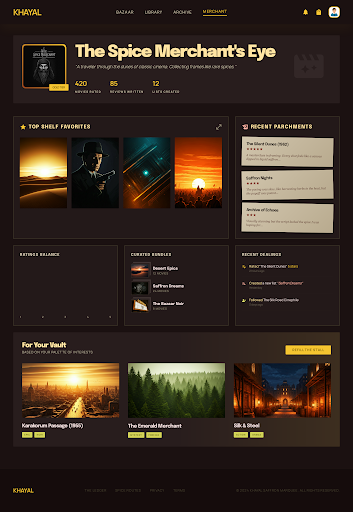

# KHAYAL · خيال
**A cinema index built for a database systems class**

🌐 **Live:** [movie-db-one-psi.vercel.app](https://movie-db-one-psi.vercel.app) &nbsp;|&nbsp; 💻 **Code:** [github.com/pnsw123/Movie-DB](https://github.com/pnsw123/Movie-DB)

> Think IMDb — browse 7,400+ real films and 2,800+ TV series, rate them, write reviews, build watchlists, and run your own SQL queries against a live database.

---

## Screenshots

| Browse | Search |
|:---:|:---:|
|  |  |

| Movie Detail | Profile |
|:---:|:---:|
|  |  |

---

## Tech Stack

| | Tool | What it does |
|---|---|---|
| 🖥️ | **Next.js 15** + TypeScript | Frontend framework |
| 🎨 | **Tailwind CSS** | Styling |
| 🗄️ | **Supabase** (PostgreSQL) | Database + auth + API |
| 🎬 | **TMDB API** | Source of all movie/TV data |
| ✏️ | **Google Stitch** | UI design & prototyping |
| ☁️ | **GitHub Actions** | Nightly cloud sync — runs even when your Mac is off |
| 🚀 | **Vercel** | Hosting — auto-deploys on every push |

---

## Where the data comes from

All titles, posters, and trailers come from **[TMDB](https://www.themoviedb.org/)** — the same API used by Plex and Letterboxd.

```
TMDB API → Python scripts → Supabase (PostgreSQL) → Next.js app
```

A Python script fetches movies and TV shows from TMDB and loads them into the database. A **GitHub Actions** cron job runs this every night at 3 AM UTC — fully automatic, no computer needed.

---

## Project Structure

```
Movie-DB/
├── khayal/               ← Next.js frontend
│   └── src/
│       ├── app/          ← Pages: /browse, /search, /movies/[slug], /profile…
│       ├── components/   ← movie-card, shelf, rate-widget, trailer, nav…
│       └── lib/          ← Supabase clients, auth helpers
│
├── scripts/              ← Python data pipeline
│   ├── daily_sync.py     ← Nightly TMDB sync (runs on GitHub Actions)
│   ├── test_daily_sync.py← 54 automated tests
│   └── seed_tmdb.py      ← Initial bulk load
│
├── supabase/migrations/  ← All SQL schema changes
└── .github/workflows/    ← daily-sync.yml (cloud cron job)
```

---

## Database — Supabase (PostgreSQL)

| Table | Contents |
|---|---|
| `movies` | 7,400+ films — title, poster, runtime, age rating, trailer |
| `tv_series` | 2,800+ shows — same fields + status (ongoing / ended) |
| `ratings` | One rating (1–10) per user per title |
| `reviews` | User reviews with spoiler toggle |
| `lists` | Watchlists — public or private |
| `profiles` | One row per signed-in user |

**Security:** Row-Level Security (RLS) means users can only edit their own data. The SQL explorer only allows `SELECT` — no one can modify the database from the browser.

---

## UI Design — Google Stitch

The full interface was designed in **Google Stitch** before writing any code — layout, color palette, components, and mobile views. The dark cinema aesthetic (black background, cream text, gold accent) was defined there and then built with Tailwind CSS.

---

## Cloud Automation — GitHub Actions

The catalog stays current automatically. Every night at 3 AM UTC, GitHub's servers run:
1. Fetch movies released in the last 2 days from TMDB
2. Skip anything already in the database
3. Insert new titles with poster URLs and metadata
4. Run 54 tests to confirm nothing broke

No local machine needed — it runs in the cloud.

---

*KHAYAL uses the TMDB API but is not affiliated with TMDB.*
خيال (*khayāl*) — Arabic for *imagination*
