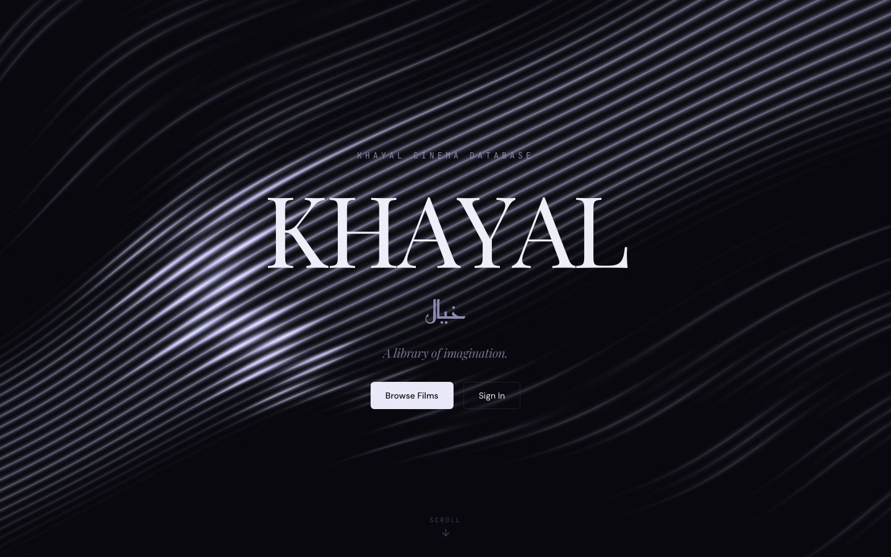
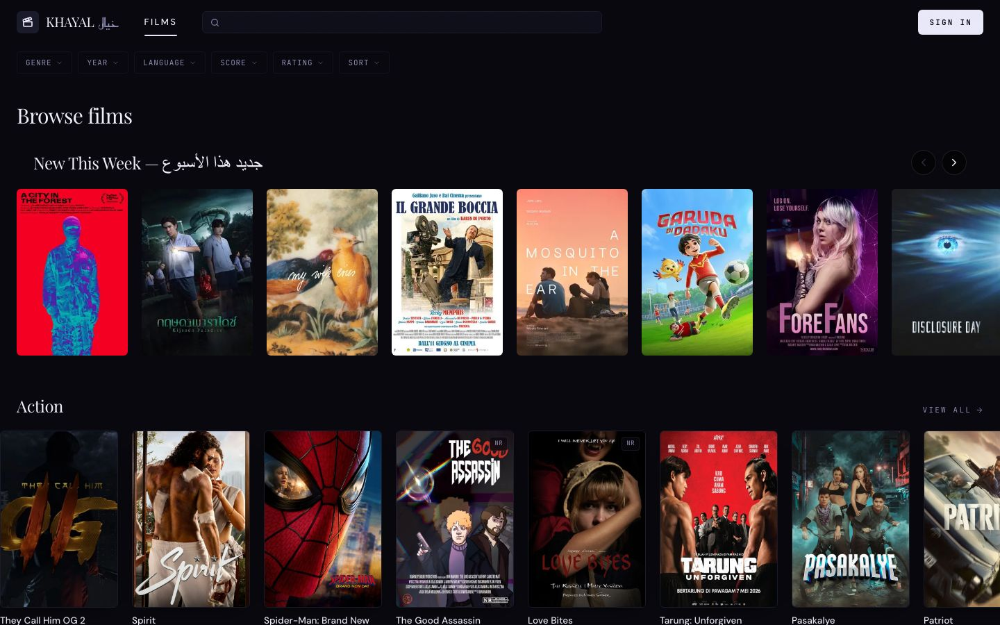
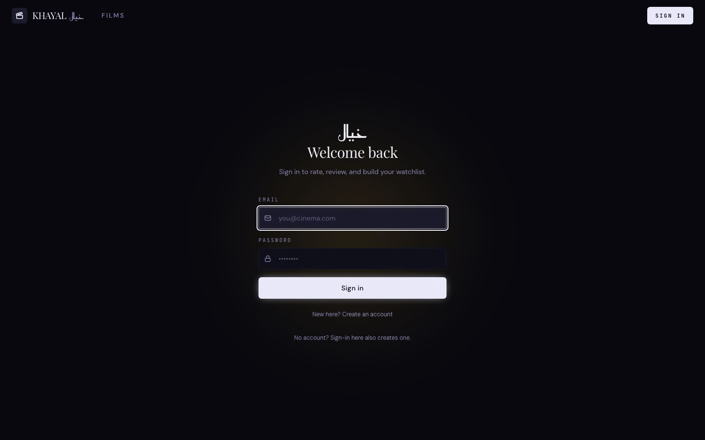

# KHAYAL · خيال

**Live:** [movie-db-one-psi.vercel.app](https://movie-db-one-psi.vercel.app) &nbsp;|&nbsp; **Code:** [github.com/pnsw123/Khayal](https://github.com/pnsw123/Khayal)

Film & TV discovery platform — 7,400+ films, 2,800+ TV series. Rate, review, build watchlists, get ML recommendations. Nightly TMDB sync via GitHub Actions.

---

## Screenshots



| Browse | Movie Detail |
|:---:|:---:|
|  |  |



---

## Tech Stack

[](https://nextjs.org)
[](https://www.typescriptlang.org)
[](https://tailwindcss.com)
[](https://supabase.com)
[](https://www.postgresql.org)
[](https://www.python.org)
[](https://github.com/features/actions)
[](https://vercel.com)

| Layer | Tools |
|---|---|
| Frontend | Next.js 16 · React 19 · TypeScript strict · Tailwind CSS v4 |
| Animation | motion/react · GSAP · Three.js (WebGL wave) |
| Backend | Supabase (PostgreSQL) · Row-Level Security · RPC functions |
| Auth | Supabase Auth — email/password + magic link |
| Data | TMDB API → Python sync scripts → Supabase |
| ML | scikit-surprise SVD · cornac · GIN full-text search |
| CI/CD | GitHub Actions (nightly sync at 3 AM UTC) · Vercel |
| Testing | Vitest (933 tests) · Playwright (visual regression) · Semgrep |

---

## Database Schema

**12 tables.** Row-Level Security on all user-owned data.

| Table | Contents |
|---|---|
| `movies` | 7,400+ films — title, poster, runtime, age rating, trailer |
| `tv_series` | 2,800+ shows + status (ongoing / ended) |
| `movie_ratings` / `tv_series_ratings` | One rating (1–10) per user per title |
| `movie_reviews` / `tv_series_reviews` | Reviews with spoiler toggle |
| `user_lists` | Watchlists — public or private |
| `recommendations` | Pre-computed ML similar titles |
| `profiles` | One row per signed-in user |

---

## Project Structure

```
khayal/
├── src/
│   ├── app/          ← Pages: /browse  /movies/[slug]  /tv/[slug]  /search  /profile
│   ├── components/   ← movie-card, shelf, trailer, nav, landing sections
│   └── lib/          ← Supabase clients, auth helpers, search API
├── scripts/          ← Python TMDB sync + ML training (scikit-surprise, cornac)
├── supabase/
│   └── migrations/   ← 17 SQL migrations in order
└── .github/workflows/← daily-sync.yml — cloud cron job
```

---

## Cloud Automation

Every night GitHub Actions:
1. Fetches titles released in the last 2 days from TMDB
2. Skips anything already in the database
3. Inserts new titles with posters, trailers, metadata
4. Runs the test suite — blocks merge on failure

---

*KHAYAL uses the TMDB API but is not affiliated with TMDB.*  
خيال (*khayāl*) — Arabic for *imagination*
