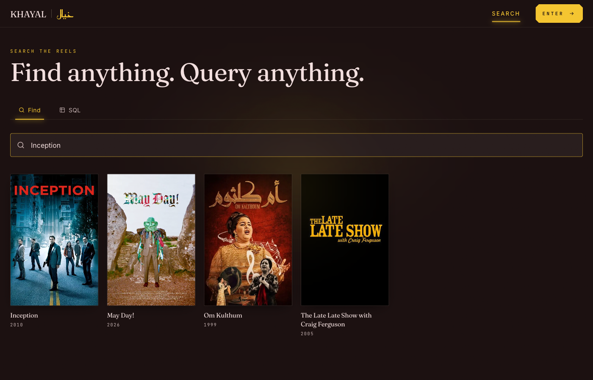
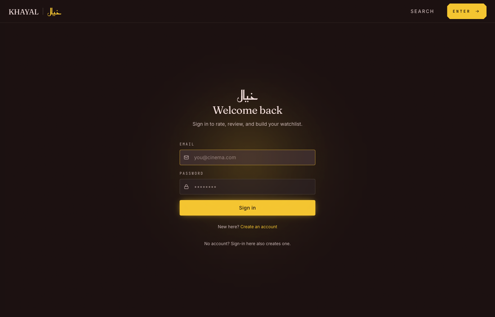
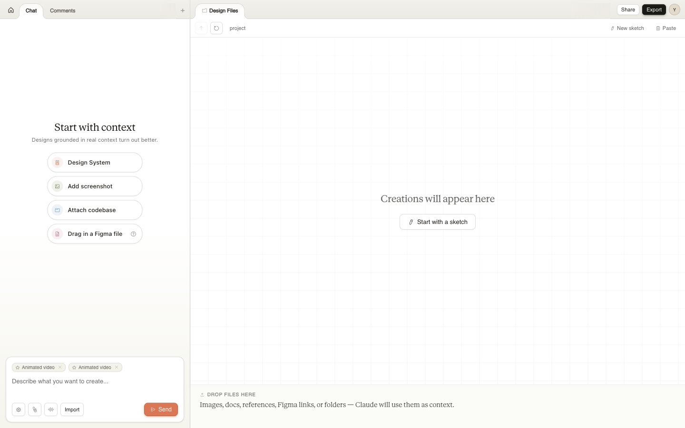
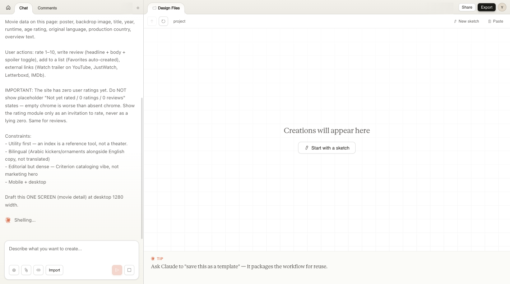
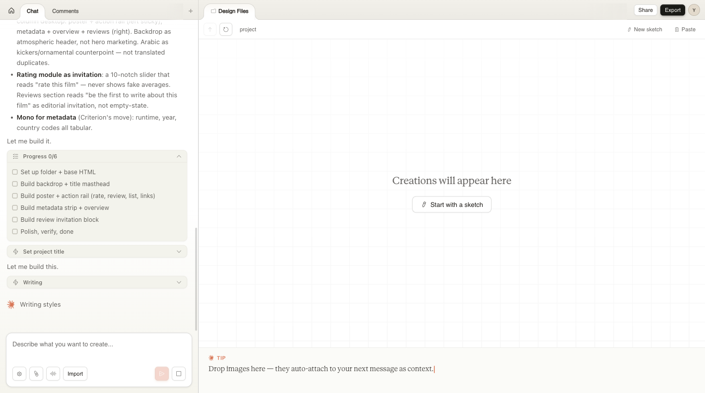

# KHAYAL · خيال
### A Cinema Index — Database Systems Class Project

**Live:** [movie-db-one-psi.vercel.app](https://movie-db-one-psi.vercel.app) &nbsp;|&nbsp; **Code:** [github.com/pnsw123/Movie-DB](https://github.com/pnsw123/Movie-DB)

> Browse 7,400+ real films and 2,800+ TV series, rate them, write reviews, build watchlists, and run your own SQL queries against a live database.

---

## Screenshots

| Browse | Search |
|:---:|:---:|
|  |  |

| Movie Detail | Sign In |
|:---:|:---:|
|  |  |

---

## Tech Stack

[](https://nextjs.org)
[](https://www.typescriptlang.org)
[](https://tailwindcss.com)
[](https://supabase.com)
[](https://www.postgresql.org)
[](https://www.python.org)
[](https://www.themoviedb.org)
[](https://stitch.withgoogle.com)
[](https://github.com/features/actions)
[](https://vercel.com)

| Tool | Role |
|---|---|
| **Next.js 15** + TypeScript | Frontend framework — server-rendered pages, App Router |
| **Tailwind CSS** | Styling |
| **Supabase** (PostgreSQL) | Database + authentication + Row-Level Security |
| **TMDB API** | Source of all movie & TV data — posters, trailers, metadata |
| **Google Stitch** | UI design & prototyping before any code was written |
| **GitHub Actions** | Nightly cloud sync — fetches new movies every night at 3 AM UTC |
| **Vercel** | Hosting — auto-deploys on every push to `main` |
| **Python** | Data pipeline — seeds and syncs 10,000+ titles from TMDB |

---

## Where the Data Comes From

All titles, posters, backdrops, and trailers come from **[TMDB](https://www.themoviedb.org/)** — the same API used by Plex and Letterboxd.

```
TMDB API → Python scripts → Supabase (PostgreSQL) → Next.js app
```

A Python script fetches movies and TV shows and loads them into the database. A **GitHub Actions** cron job runs this automatically every night at 3 AM UTC — no computer needed.

---

## Project Structure

```
KHAYAL/
├── khayal/               ← Next.js frontend (everything users see)
│   └── src/
│       ├── app/          ← Pages: /browse  /search  /movies/[slug]  /profile…
│       ├── components/   ← movie-card, shelf, rate-widget, trailer, nav…
│       └── lib/          ← Supabase clients, auth helpers
│
├── scripts/              ← Python data pipeline
│   ├── daily_sync.py     ← Nightly sync (runs on GitHub Actions cloud)
│   ├── test_daily_sync.py← 54 automated tests
│   └── seed_tmdb.py      ← Initial bulk load from TMDB
│
├── supabase/migrations/  ← All SQL schema changes in order
└── .github/workflows/    ← daily-sync.yml — cloud cron job
```

---

## Database — Supabase (PostgreSQL)

**12 tables total.**

| Table | Contents |
|---|---|
| `movies` | 7,400+ films — title, poster, runtime, age rating, trailer |
| `tv_series` | 2,800+ shows — same fields + status (ongoing / ended) |
| `movie_ratings` | One rating (1–10) per user per movie |
| `tv_series_ratings` | Same for TV series |
| `movie_reviews` | User reviews for movies with spoiler toggle |
| `tv_series_reviews` | Same for TV series |
| `user_lists` | Watchlists — public or private |
| `user_list_movies` | Movies inside each watchlist |
| `user_list_tv_series` | TV series inside each watchlist |
| `profiles` | One row per signed-in user |
| `recommendations` | Pre-computed similar titles |
| `saved_queries` | User's saved SQL queries from the explorer |

**Security:** Row-Level Security (RLS) ensures users can only edit their own data. The SQL explorer tab only allows `SELECT` — no one can modify the database from the browser.

---

## UI Design — Google Stitch

The full interface was designed inside Google Stitch — prompting the AI with layout requirements, color palette, and component specs before writing any code.

| Starting a project | Writing the prompt | Stitch generating the UI |
|:---:|:---:|:---:|
|  |  |  |

---

## Cloud Automation — GitHub Actions

[](https://github.com/pnsw123/Movie-DB/actions)

Every night GitHub's servers automatically:
1. Fetch movies released in the last 2 days from TMDB
2. Skip anything already in the database
3. Insert new titles with posters and metadata
4. Run 54 tests to confirm nothing broke

No local machine needed — fully independent of any computer.

---

*KHAYAL uses the TMDB API but is not affiliated with TMDB.*  
خيال (*khayāl*) — Arabic for *imagination*
