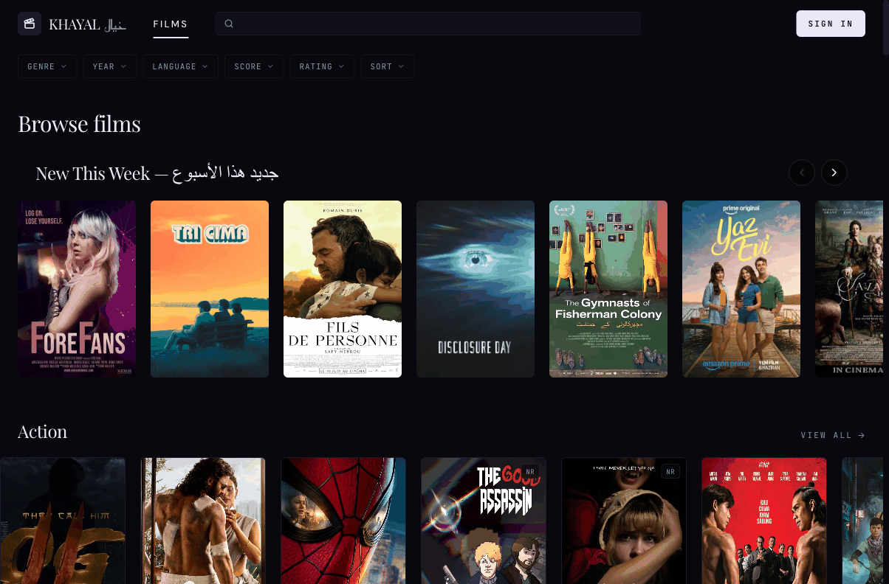
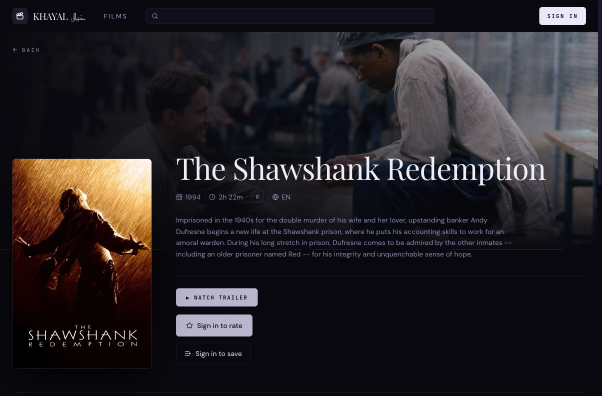
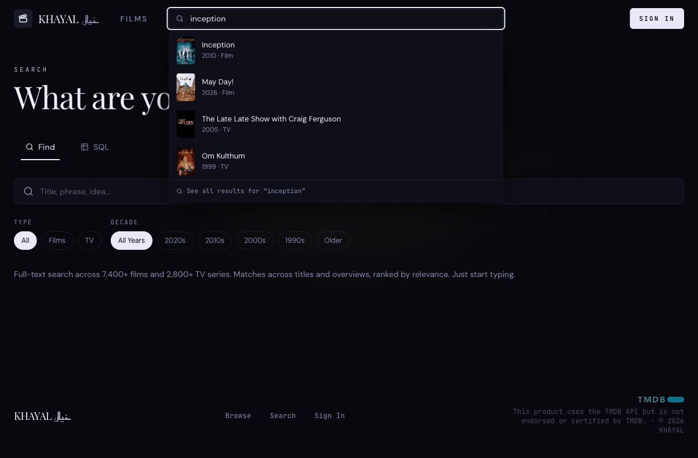
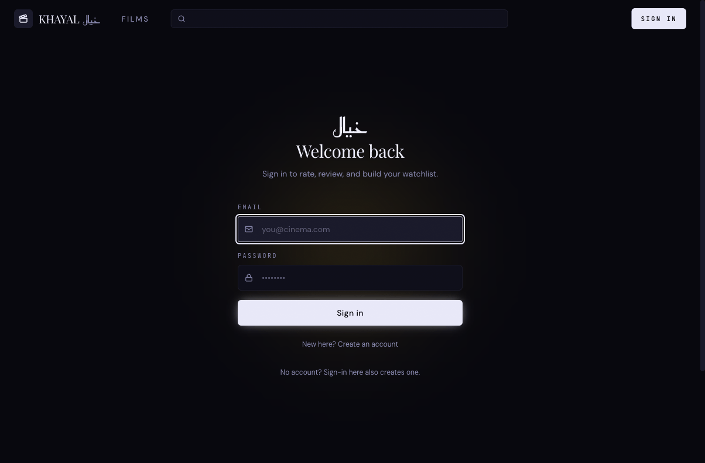

<div align="center">

# KHAYAL · خيال

**A cinematic discovery platform — 7,400+ films · 2,800+ TV shows**

[](https://movie-db-one-psi.vercel.app)
[](https://nextjs.org)
[](https://www.typescriptlang.org)
[](https://supabase.com)

[](https://github.com/pnsw123/Khayal/actions/workflows/ci.yml)

</div>

---

## Screenshots

| Browse | Detail | Search | Recommendations |
|--------|--------|--------|-----------------|
| [](https://movie-db-one-psi.vercel.app/browse) | [](https://movie-db-one-psi.vercel.app/movies/inception-2010) | [](https://movie-db-one-psi.vercel.app/search) | [](https://movie-db-one-psi.vercel.app/profile) |

**[Open live demo](https://movie-db-one-psi.vercel.app)**

---

## Demo

| Feature | What to try | URL |
|---------|-------------|-----|
| Browse | Scroll the catalogue, filter by genre | [/browse](https://movie-db-one-psi.vercel.app/browse) |
| Search | Type any title or actor name | [/search](https://movie-db-one-psi.vercel.app/search) |
| Rate | Click a title → rate it 1–10 | any title page |
| Recommendations | Rate 5+ films first — recommendations cold-start after your 5th rating | [/browse](https://movie-db-one-psi.vercel.app/browse) |
| Reviews | Write a review with optional spoiler blur | any title page |
| Watchlist | Add titles to a custom list | any title page |

> **Note:** Poster and backdrop images are served via the TMDB image CDN (`image.tmdb.org`). If TMDB's CDN is unreachable in your region, images will not load — the rest of the app remains functional. This product uses the TMDB API but is not endorsed or certified by TMDB.

---

## What It Does

Browse, search, and track films and TV shows from a curated database of 7,400+ films and 2,800+ TV shows synced nightly from TMDB. Rate titles on a 10-point scale, write reviews with optional spoiler blur, build watchlists, and get personalised recommendations based on your rating history.

---

## Features

- Instant search — full-text RPC across 10,200+ titles with live dropdown
- Personalised recommendations — collaborative filtering via scikit-surprise / cornac, retrained daily
- Watchlists — add films and shows to custom lists, mark favourites
- 10-point rating system — per-user ratings, aggregated into per-title averages
- Reviews with spoiler toggle — headline + body; readers can hide spoilers
- Daily TMDB sync — GitHub Actions cron keeps the catalogue fresh
- Admin panel — content moderation and user role management

---

## Tech Stack

| Layer | Technology |
|---|---|
| Frontend | Next.js 15 (canary), React 19, TypeScript 5 (strict mode) |
| Styling | Tailwind CSS v4, CSS custom properties |
| UI Components | ReactBits, Radix UI primitives |
| Animation | Three.js, Framer Motion, Embla Carousel |
| Database | Supabase (PostgreSQL) — RLS, RPC functions, materialised views |
| Auth | Supabase Auth (email + OAuth) |
| Data sync | Python / TMDB API → Supabase (GitHub Actions daily cron) |
| ML | scikit-surprise, cornac — personalised recommendations |
| Deployment | Vercel |

---

## Quick Start

```bash
git clone https://github.com/pnsw123/Khayal.git
cd Khayal
npm install

cp .env.example .env.local
# Fill in: NEXT_PUBLIC_SUPABASE_URL and NEXT_PUBLIC_SUPABASE_ANON_KEY

npm run dev
# open http://localhost:3000
```

---

## Environment Variables

### Required to run

| Variable | Description |
|---|---|
| `NEXT_PUBLIC_SUPABASE_URL` | Supabase project URL |
| `NEXT_PUBLIC_SUPABASE_ANON_KEY` | Supabase anon/public key |

### Production only

| Variable | Description |
|---|---|
| `UPSTASH_REDIS_REST_URL` | Upstash Redis URL — rate limiter on `/auth/callback` |
| `UPSTASH_REDIS_REST_TOKEN` | Upstash Redis token |

> Rate limiter auto-disables in dev if Redis vars are absent.

### Python sync scripts only

| Variable | Description |
|---|---|
| `SUPABASE_SERVICE_ROLE_KEY` | Service role key |
| `TMDB_API_KEY` | TMDB API v3 key — [free at themoviedb.org](https://www.themoviedb.org/settings/api) |

---

## Deploy

[](https://vercel.com/new/clone?repository-url=https%3A%2F%2Fgithub.com%2Fpnsw123%2FKhayal&env=NEXT_PUBLIC_SUPABASE_URL,NEXT_PUBLIC_SUPABASE_ANON_KEY,UPSTASH_REDIS_REST_URL,UPSTASH_REDIS_REST_TOKEN)

---

## Data Attribution

<a href="https://www.themoviedb.org" target="_blank">
  
</a>

This product uses the TMDB API but is not endorsed or certified by TMDB.

---

## License

[MIT](LICENSE)
